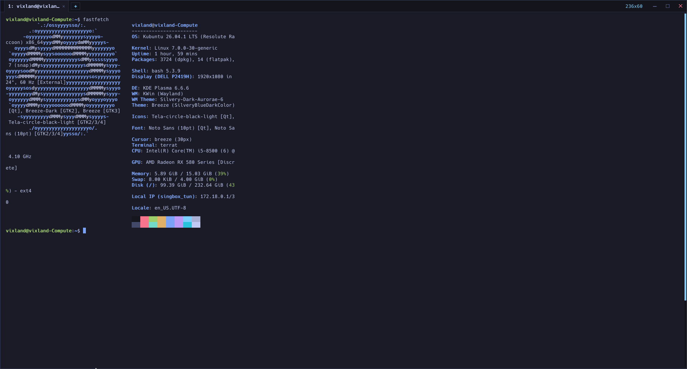

<p align="center">
  
</p>

<h1 align="center">TerraTerminal (<code>terrat</code>)</h1>

<p align="center">
  <b>A lightweight, frameless minimalist terminal emulator for Linux and Windows, written in pure Go.</b>
  <br>
  <i>Zero CGO &bull; Sub-5ms Cold Boot &bull; ~11MB Idle RAM &bull; Single Static Binary</i>
</p>

<p align="center">
  <a href="#why-terrat">Why Terrat</a> &bull;
  <a href="#features">Features</a> &bull;
  <a href="#shortcuts">Shortcuts</a> &bull;
  <a href="#configuration">Configuration</a> &bull;
  <a href="#installation">Installation</a> &bull;
  <a href="#benchmarks">Benchmarks</a>
</p>

<p align="center">
  
</p>

> [!NOTE]  
> **Terrat is currently under active development.**  
> You might encounter bugs, rough edges, or missing terminal sequences. If you run into any issues or have suggestions, please feel free to [open an issue on GitHub](https://github.com/vixland4509/Terrat/issues)! Contributions and bug reports are very welcome.

---

## Why Terrat?

Most terminal emulators today fall into two frustrating extremes:
1. **Web-bloated beasts** (Electron, WebAssembly, heavy webviews) that gobble 200MB–400MB of RAM just to show a shell prompt.
2. **C/C++ legacy terminals** that require tangled dynamic linkers, fragile CGO bindings, or sprawling toolchains.

**TerraTerminal (`terrat`)** takes a radically simpler path:
- **100% Pure Go:** On Linux it talks directly to the X11 display server through the raw wire protocol (`xgb`); on Windows it uses the native ConPTY API. Zero CGO, zero system library headaches.
- **Cross-Platform:** Builds and runs natively on both **Linux** (X11 / XWayland) and **Windows** (10/11 via ConPTY), with smart shell detection (Git Bash, WSL, PowerShell, cmd) out of the box.
- **Universal Desktop Compatibility:** Runs smoothly across all Linux desktop environments and window managers (GNOME, KDE Plasma, XFCE, Cinnamon, MATE, LXQt, i3, bspwm, Hyprland, Sway, etc.) via X11 or XWayland.
- **Microsecond cold boot:** Pops up on your screen in less than **5 milliseconds**.
- **Flyweight memory footprint:** Stays under **~11MB RSS** in everyday use.
- **Hardware-smooth visuals:** True double-buffering via server-side pixmaps completely eliminates window tearing and resize flicker.
- **Built-in essentials:** Ships with the features developers actually use every day—tabs, find-in-buffer, clickable URLs, live font zoom, curated themes, and system dark-mode detection—without installing plugins.

---

## Features

### 1. Frameless Custom Frame (CSD)
- Clean, distraction-free window header with 1px hairline border.
- Minimalist window control dots (macOS / Ghostty style): Close, Minimize, and Toggle Maximize.
- Integrated micro-HUD displaying live terminal grid dimensions (e.g. `80x24`).
- Full window movement by dragging anywhere on the header bar.
- Interactive 8-direction edge and corner resizing with proper cursor morphing (`ResizeTop`, `ResizeBottomRight`, etc.).

### 2. Native Multi-Tabs
- Isolated sessions: each tab runs its own pseudo-terminal (PTY), terminal state machine, and command stream.
- Sleek tab pills in the header bar showing the active process (`bash`, `nvim`, `htop`).
- Mouse-interactive: click a tab to switch, click `×` to close, or click `+` to spawn a new session.
- Seamless shell exit: closing a shell closes its tab; exiting the last tab cleanly exits the application.

### 3. Live Font Zooming
- Scale font size up or down in real time with `Ctrl+=` / `Ctrl+-` or `Ctrl + MouseWheel`.
- In-memory glyph regeneration takes `<0.1ms` with zero disk I/O.
- Window grid (`cols` / `rows`) automatically recalculates, and PTY sends `SIGWINCH` to running child processes without dropping active state.
- Font preferences are automatically remembered and saved to config.

### 4. Smart URL Detection & External Launcher
- Automatically recognizes URLs (`http://`, `https://`) across visible terminal rows.
- Holding `Ctrl` while hovering a link draws a clean underline and changes the cursor to a pointer (`XC_hand2`).
- `Ctrl + Left Click` opens the link in your system's default browser via `xdg-open` in the background without blocking terminal execution.

### 5. In-Buffer Search (Find)
- Floating minimal search bar opened via `Ctrl+Shift+F`.
- Live match highlighting directly on the canvas:
  - **All matches:** Warm amber glow (`#e0af68`).
  - **Active match:** Vivid emerald highlight (`#9ece6a`).
- Real-time match counter badge (e.g. `(1/5)` or `(0/0)`).
- Quick navigation using `Enter` (next) and `Shift+Enter` (previous).

### 6. Interactive Preferences & Curated Themes
- Floating modal accessible anytime via `Ctrl+,`, `Ctrl+Shift+P`, or by clicking the header HUD.
- Five built-in color palettes:
  - **Tokyo Night** (Dark &mdash; Iconic midnight blue)
  - **Catppuccin Mocha** (Dark &mdash; Velvet charcoal)
  - **Tokyo Day** (Light &mdash; Crisp sunlight paper)
  - **Solarized Light** (Light &mdash; Warm parchment)
  - **System Auto-Detect** (Follows your OS Dark/Light mode via XDG Desktop Portal / DBus / KDE / GNOME)
- Live preview while navigating themes before saving.
- Dynamic color remapping: instantly updates scrollback history, running apps, and clears screens without visual artifacting or dark patches.

### 7. Window Opacity / Transparency
- Native X11 composite transparency via `_NET_WM_WINDOW_OPACITY`.
- Compatible with Picom, Mutter (GNOME), KWin (KDE), and Xfwm.
- Default 95% opacity (`0.95`) for a subtle luxury look without sacrificing legibility.

### 8. Intuitive Mouse Selection & Smart Clipboard System
- Drag left-click to select text with full block highlight.
- **Double-click:** Selects whole word (including paths, symbols, and hostnames).
- **Triple-click:** Selects entire row.
- **Middle-click:** Pastes from `PRIMARY` selection.
- **Smart Ctrl+C:** If text is selected, `Ctrl+C` copies to clipboard; if no text is selected, it sends standard `SIGINT` to interrupt the current process.
- **Smart Ctrl+V:** Pastes from clipboard in normal shell mode, while intelligently preserving `Ctrl+V` for visual-block selection inside full-screen editors (`vim`, `nano`).
- **Bracketed Paste Mode (DECSET 2004):** Seamless multi-line paste that prevents staircase effect and broken indentation in Python REPLs, Node, and shells by wrapping pasted streams in standard terminal boundary markers (`\e[200~` ... `\e[201~`).
- **Anti-Pastejacking Sanitization:** Automatically strips malicious ANSI escape sequences, raw control codes, zero-width spaces, and bidirectional Unicode overrides before executing.

### 9. Smart Inline Ghost Text (Fish-like Autosuggestions)
- Real-time command completion suggestions drawn directly in front of the cursor in subtle muted gray.
- Automatically learns from your shell history (`~/.bash_history`, `~/.zsh_history`) and commands executed during the session.
- Press **`Right Arrow`** or **`Tab`** to instantly accept and complete the suggested command.
- Zero flicker or buffer distortion: suggestions are rendered as a non-destructive visual overlay and automatically disabled inside full-screen apps (`nvim`, `htop`).

### 10. Live Command Diagnostics & Typo Detector
- Real-time pre-execution syntax and typo linting as you type.
- Detects common command typos (`gti` &rarr; `git`, `sl` &rarr; `ls`, `dokcer` &rarr; `docker`), subcommand mistakes (`git puch` &rarr; `git push`), and unclosed quote strings.
- Displays an amber/red diagnostic chip in the window header bar with the exact reason and fix.
- Press **`Alt + Enter`** to automatically apply the recommended QuickFix directly to your shell prompt!

---

## Shortcuts

### Safe Paste & Clipboard
| Shortcut | Action |
| :--- | :--- |
| `Ctrl + V` (in shell) / `Ctrl + Shift + V` / `Shift + Insert` | Paste text from clipboard |
| `Ctrl + Shift + C` (or `Ctrl + C` with selection) | Copy selected text to clipboard |
| `Middle Click` | Paste from X11 `PRIMARY` selection |

### Autosuggest & Diagnostics
| Shortcut | Action |
| :--- | :--- |
| `Tab` / `Right Arrow` | Accept & complete inline Ghost Text suggestion |
| `Alt + Enter` | Automatically apply QuickFix for diagnosed typo |
| `Ctrl + Shift + D` | Toggle Live Command Diagnostics on / off |

### Tabs
| Shortcut | Action |
| :--- | :--- |
| `Ctrl + Shift + T` | Open new tab |
| `Ctrl + Shift + W` | Close active tab |
| `Ctrl + Tab` / `Ctrl + PageDown` | Switch to next tab |
| `Ctrl + Shift + Tab` / `Ctrl + PageUp` | Switch to previous tab |
| `Alt + 1` .. `Alt + 9` | Jump directly to tab 1 through 9 |

### Search & Links
| Shortcut | Action |
| :--- | :--- |
| `Ctrl + Shift + F` | Toggle in-buffer search bar |
| `Enter` / `Shift + Enter` | Jump to next / previous search match |
| `Esc` | Close search bar & clear highlights |
| `Ctrl + Hover` | Underline detected URL |
| `Ctrl + Left Click` | Open hovered URL in default web browser |

### Font Zoom
| Shortcut | Action |
| :--- | :--- |
| `Ctrl + =` / `Ctrl + +` | Increase font size by 1pt |
| `Ctrl + -` / `Ctrl + _` | Decrease font size by 1pt |
| `Ctrl + 0` | Reset font size to default (13pt) |
| `Ctrl + Wheel Up` / `Down` | Zoom in / out with mouse wheel |

### Preferences & Clipboard
| Shortcut | Action |
| :--- | :--- |
| `Ctrl + ,` / `Ctrl + Shift + P` | Open / close Preferences modal |
| `Ctrl + Shift + A` | Select all text in terminal buffer |
| `Ctrl + Shift + C` (or `Ctrl + C` with selection) | Copy selected text to clipboard |
| `Ctrl + Shift + V` / `Shift + Insert` | Paste text from clipboard |
| `Shift + PageUp` / `PageDown` | Scroll terminal history up / down |

---

## Benchmarks

Tested on Linux 6.x (X11 / Pure Go build):

| Metric | TerraTerminal (`terrat`) | Default System Terminal (Konsole) |
| :--- | :--- | :--- |
| **Cold Startup Time** | **~4.6 ms** (0.0046s) | ~40 – 120 ms |
| **Idle Memory (RSS)** | **~11 MB** | ~168 MB *(15x heavier)* |
| **Idle CPU Usage** | **0.00%** (Full kernel sleep) | 0.2% – 1.5% |
| **Binary Size** | **3.7 MB** (Single self-contained) | Multi-MB dynamic libraries |
| **External Dependencies** | **None** (Zero CGO / Pure Go) | Qt / GTK / C++ runtimes |

---

## Configuration

Settings are saved automatically in `~/.config/terrat/config.json`:

```json
{
  "theme": "auto",
  "font_size": 13.0,
  "opacity": 0.95,
  "ghost_text": true,
  "diagnostics": true,
  "sanitize_paste": true,
  "bracketed_paste": true
}
```

- `theme`: `"auto"`, `"tokyo-night"`, `"catppuccin-mocha"`, `"minecraft"`, `"tokyo-day"`, or `"solarized-light"`.
- `font_size`: Floating-point font size in points (`8.0` to `32.0`).
- `opacity`: Window opacity from `0.20` to `1.0` (compositor required for transparency).
- `ghost_text`: Enable/disable inline command autosuggestions (`true` or `false`).
- `diagnostics`: Enable/disable real-time typo diagnostics and linting (`true` or `false`).
- `sanitize_paste`: Strip malicious ANSI escape codes, zero-width spaces, and bidi overrides (`true` or `false`).
- `bracketed_paste`: Wrap pasted text in DECSET 2004 bracketed paste markers for safe REPL indentation (`true` or `false`).

---

## Installation

### Prerequisites
- **Linux:** any desktop environment or window manager (GNOME, KDE Plasma, XFCE, Cinnamon, MATE, LXQt, i3, bspwm, Hyprland, Sway, etc.) via X11 or XWayland.
- **Windows:** Windows 10 or 11 (uses the built-in ConPTY API; no extra dependencies).
- Go 1.21+ (only required for building from source).

### Pre-built Packages & Release Downloads

Ready-to-use binaries and distro packages are available in every release:

#### Debian / Ubuntu / Linux Mint / Pop!_OS (`.deb`)
```bash
sudo apt install ./terrat_*_amd64.deb    # or arm64
```

#### Fedora / RHEL / CentOS / openSUSE (`.rpm`)
```bash
sudo dnf install ./terrat-*-1.x86_64.rpm  # or aarch64
```

#### Arch Linux / Manjaro / EndeavourOS (`.pkg.tar.zst`)
```bash
sudo pacman -U ./terrat-*-1-x86_64.pkg.tar.zst  # or aarch64
```

#### Linux Portable (`.tar.gz`)
Extract and run standalone anywhere, or run the optional user-space installer:
```bash
tar -xzf terrat-v*-linux-amd64.tar.gz
cd terrat-v*-linux-amd64

# Run directly without installing:
./terrat

# Or install for current user (~/.local/bin and desktop menu) without sudo:
./install.sh
```

#### Windows Portable (`.zip`)
Download `terrat-v*-windows-amd64.zip`, extract, and launch `terrat.exe`. No installation required.

---

### Build from Source
```bash
# Clone the repository
git clone https://github.com/vixland4509/Terrat.git
cd Terrat

# Build binary
make build

# Run immediately
./terrat

# Install to ~/go/bin with desktop shortcut
make install

# Build all packages (.deb, .rpm, Arch, and portable tar/zip)
make release
```

### Launch with Custom Command
```bash
# Launch a specific utility directly
terrat -e htop
terrat -e nvim
terrat -e /bin/zsh
```

---

## License

Open source under the [GNU General Public License v3.0 (GPLv3)](LICENSE).
